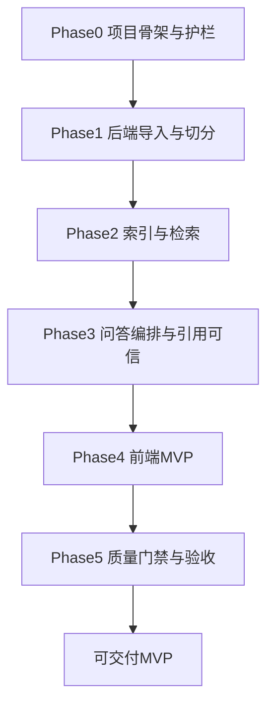

# Codebase RAG Explorer 开发路线（精简版）

## 目标与输入
- 以 [PRD](PRD.md) 的 MVP 闭环为主线：导入仓库 → 切分 → 索引 → 检索 → 回答 → 引用返回。
- 以 [TRD](TRD.md) 的技术选型与模块边界为落地约束（Bun + Elysia + LangChain + SQLite + React）。
- 借鉴 `Effective-Harnesses-for-Long-Running-Agents` 的核心思想：**标准化会话恢复、增量交付、强制验证、可追溯进度**；但不采用 `init.sh` 与 200+ feature 粒度。

## Harness 轻量化设计（先于编码）
- 建立一个“项目级长任务护栏”，只保留 3 个工件：
  - `docs/dev-roadmap.md`：阶段与里程碑（10-20 个里程碑，不再细分到 200+）。
  - `docs/dev-progress.md`：每次开发会话追加日志（做了什么、测了什么、下一步）。
  - `docs/acceptance-gates.md`：阶段退出条件与最小验证清单。
- 会话标准流程固定为：读进度 → 跑最小冒烟验证 → 只做 1 个里程碑 → 跑对应测试 → 记录进度。
- 防“过早完成”机制：仅当 `acceptance-gates` 全部满足，才允许标记 MVP 完成。

## 分阶段路线

### Phase 0：项目骨架与共享契约
- 建立 TRD 约定的 monorepo 目录：`apps/server`、`apps/web`、`packages/types`、`packages/api-client`、`packages/constants`。
- 完成基础脚手架：workspace scripts、TS 配置、`.env.example`、SQLite 初始 schema。
- 优先实现共享类型与错误码（`ApiResponse`、`ErrorCode`、`AskData` 等），确保前后端协议先行。
- **退出标准**：`bun install`、`bun run dev`、`bun run typecheck` 可通过，基础 API 健康检查可返回统一响应结构。

### Phase 1：后端导入与切分
- 实现 `RepoService`：本地路径与 Git 地址导入、忽略规则过滤、状态写入。
- 实现 `SplitterService` 两阶段策略：Tree-sitter 语义切分 + Recursive splitter 兜底。
- 建立 chunks 持久化与 repo 状态流转（`loaded -> indexing/indexed` 前置能力）。
- **退出标准**：可导入示例仓库并产出结构化 chunk；错误场景返回 `1001/1002` 等约定码。

### Phase 2：索引与检索
- 实现 `EmbedderService`：批量 embedding、落库（embeddings 表）。
- 实现 `RetrievalService`：query embedding + cosine top-k + chunks 回查。
- 对齐可配置项：`DEFAULT_TOP_K`、`CHUNK_MAX_LENGTH`、`MAX_CONTEXT_TOKENS`。
- **退出标准**：给定测试问题能稳定返回 top-k 代码片段，且排序与可追溯性正确。

### Phase 3：问答编排与“可信引用”闭环
- 实现 `AskService`：索引状态校验、空检索分支（`3001`）、上下文拼装、LLM 调用。
- 强约束：引用只来自检索白名单，不从 LLM 文本反向抽取，避免 hallucinated references。
- 对齐 PRD 的接口语义：成功时 `answer` 非空；失败时 `data=null` 且 message 明确。
- **退出标准**：`/api/ask` 在成功/未索引/无结果/外部 API 失败路径下均满足协议与文案约束。

### Phase 4：前端 MVP
- 落地单页布局：仓库面板 + 问答面板，按 TRD 组件边界实现 `RepoInput`、`RepoStatus`、`ChatPanel`、`CodeReference`。
- 实现 Jotai + TanStack Query 状态流：导入、建索引、轮询状态、问答提交与错误展示。
- 回答区展示 Markdown，引用区显示 `file_path + snippet (+score)`，保证“回答与证据”可分离阅读。
- **退出标准**：用户可完整走通 PRD 核心流程，前端能区分业务错误与系统错误并给出可行动提示。

### Phase 5：质量门禁与验收
- 建立最小测试矩阵：
  - 后端单元：切分、相似度、检索排序。
  - 后端集成/API：导入、建索引、问答与错误码一致性。
  - 前端组件/Hook：输入、状态切换、错误展示。
- 准备 PRD 验收题集（>=20 题），统计事实一致率与引用可定位率。
- 补齐交付物：运行说明、示例仓库、验收报告。
- **退出标准**：达到 PRD 的功能正确性/回答质量/稳定性指标，且可重复演示。

## 里程碑粒度建议（避免过细）
- 采用 **12-18 个里程碑** 即可（按阶段拆分），每个里程碑 0.5-1 天可完成并可验证。
- 每个里程碑必须绑定：输入、输出、验证命令、失败回滚点。
- 严禁“写完再测”，坚持里程碑级验证闭环。

## 风险与对应策略
- 外部 API 不稳定：在 `acceptance-gates` 中区分“业务可预期失败”与“系统异常失败”，并强制错误码覆盖测试。
- 上下文过长导致问答波动：保留 score 截断策略与 `MAX_CONTEXT_TOKENS` 预算监控。
- 开发中期偏离目标：每个会话先核对 `dev-roadmap` 与 PRD 验收项，再动手实现。

## 完成定义（DoD）
- PRD 的 MVP 闭环全部可运行且可演示。
- TRD 约定的核心模块（Repo/Splitter/Embedder/Retrieval/Ask + 前端核心组件）均有实现与最小测试覆盖。
- `docs/dev-progress.md` 可完整追踪开发决策与验证证据，任何新会话可在 5 分钟内恢复上下文。